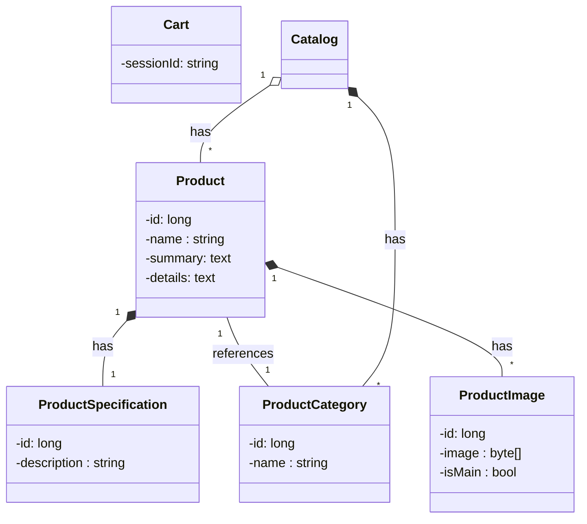
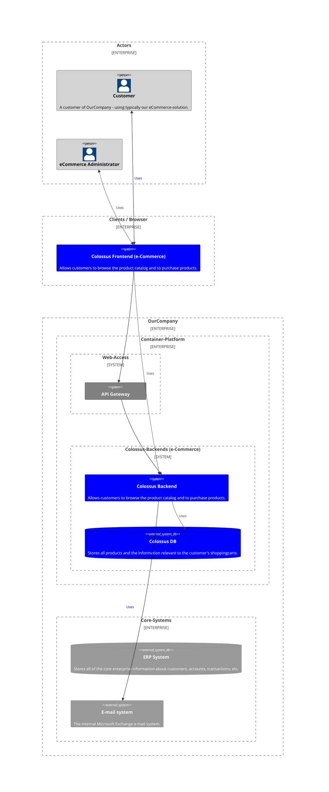

# Workshop Cleaner Architecture

## Summary

## The demo application - an eCommerce solution named 'Colossus'
As we know, the primary objective of a software is to fulfill some given requirements...
Therefore - throughout the workshop - we will learn, exercise and train the learned material in the context of a "real" world example.
We choose the example of an eCommerce solution: we call our solution 'Colossus'.

### The usecases
The usecases we focus on are:
<ol>Catalog-Management
  <li>Add/Update/Delete Product</li>
  <li>Add/Update/Delete Product-Category</li>
</ol>
<ol>Cart-Management
  <li>Add/Remove Product in Cart</li>
  <li>...</li>
</ol>

### The general data-model
The data-model we use consist of the following main objects:

### The overall architecture
The architecture in which the eCommerce-solution is embedded is as follows::

### The components
<ol>
  <li>[Colossus-Backend-Service](./colossus/backend/README-md)</li>
</ol>
